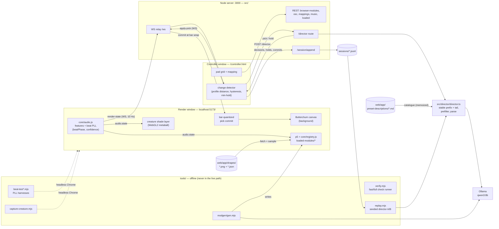

# processing-llm — browser VJ tool

Two-window browser VJ rig: Butterchurn background + hot-loaded p5 foreground
modules, steered live by audio features and a local LLM "director"
(qwen3:8b via Ollama) that picks presets and colour filters as the music
changes.

## Running a set

Prerequisites:

- Node 22+, `npm install` in both the repo root and `web/app/`.
- [Ollama](https://ollama.com) running locally with the director model pulled:
  `ollama pull qwen3:8b` (override host via `OLLAMA_HOST=host:port`).
- An audio input that carries the music. For DJ output on the same machine use
  a loopback device (macOS: [BlackHole](https://existential.audio/blackhole/),
  route system/DJ audio → BlackHole, pick it as mic); with an external mixer
  any line-in works. The render window asks for mic permission on first click.

Start:

```sh
npm run server            # controller server on :3000 (REST + WS bridge)
cd web/app && npm run dev # Vite on :5173
```

Then open two windows:

- **http://localhost:5173/** — render window. Full-screen output; click once
  to grant audio, put it on the projector/second screen. No controls.
- **http://localhost:5173/controller.html** — controller. Pad grid
  (keyboard/MIDI) for triggering modules, module list, pad-mapping editor,
  preset prev/next, and the Auto-Director panel (start it, set max
  complexity; it calls the LLM when the audio character shifts).

Both windows talk through the server's WS bridge, so they can run on
different machines if the server is reachable.

Authoring a new module (offline, not part of the live path):

```sh
npm run modgen -- --id comet-trail "a comet with a fading particle trail that pulses on bass"
```

writes `web/app/loaded-modules/<id>.js` (contract: `web/app/MODULE_ABI.md`)
and hot-loads it into a running server.

## Architecture



The live path (render + controller + server) stays boring; everything slow
or failure-prone lives in `tools/`. This diagram is kept current by rule —
see `CLAUDE.md`.

## Layout

- `src/` — Node controller server (`npm run server`,
  `src/controller/server.ts`): serves `/loaded/*` modules, module
  load/unload/trigger/enable REST, pad-mapping persistence, WS relay between
  windows, and the `/director` LLM route.
- `web/app/src/core/` — the live browser engine: `audio.js` (feature
  extraction: bands, spectral shape, BPM), `butterchurn.js` (background),
  `registry.js` + `interfaces.js` (module runtime + lifecycle middleware —
  ABI in `web/app/MODULE_ABI.md`), `pads.js`, `mapping.js`, `ws.js`.
- `web/app/loaded-modules/` — hot-loadable p5 foreground modules.
- `web/app/preset-descriptions/` — one .md per Butterchurn preset (tagged
  frontmatter + prose); this is the catalogue the director chooses from.
  Generated/refreshed by `web/app/scripts/visual-bootstrap.mjs` +
  `bootstrap-preset-descriptions.mjs` (offline, puppeteer +
  `preset-snap.html` + a vision model).
- `src/director/` — director core shared by the live route and offline
  replay: pure prompt construction (`buildDirectorPrompt`, with a `memory`
  variant that shows the model its last N picks), catalogue prefilter,
  response parsing, Ollama call.
- `tools/` — offline authoring/evaluation CLIs: `modgen/gen.mjs`,
  `replay.mjs`, `beat-test.mjs` / `beat-test-real.mjs` (beat-tracker
  harnesses), `capture-creature.mjs`, `wav-tempo.mjs`, `check-modules.mjs`,
  and `verify.mjs` — the umbrella runner (`node tools/verify.mjs` for the
  fast tier, `--full` for everything; needs server+vite+Ollama up for the
  full tier).
- `sessions/` (gitignored) — one .jsonl per Auto-Director run: every director
  decision (feature window, request, raw LLM response, pick, latency), hold
  tick, and operator action.

## Evaluating the director

Run a set with Auto-Director on — everything is recorded automatically. Then
re-run the recorded feature windows through any prompt variant with no audio:

```sh
node tools/replay.mjs sessions/<file>.jsonl --prompt-variant memory     # live default
node tools/replay.mjs sessions/<file>.jsonl --prompt-variant no-memory  # pre-memory prompt
# knobs: --history-n N  --catalogue-window N  --model <ollama model>
#        --seed N (pins candidate sampling + generation: fair A/B comparisons)
```

prints a table of original pick vs. new pick per window. Replay accumulates
its own recency/memory, so the table shows what the whole set would have
looked like under that variant. Requires Ollama running.

## Experimental

- `web/app/nca.html` + `web/app/src/nca/` — neural-cellular-automata visual
  source (vendored Hexells). Isolated from the live engine; see
  `web/app/src/nca/README.md` for status and the promotion path.
- `web/app/preset-snap.html` — headless Butterchurn driver used only by the
  preset-description bootstrap scripts, never during a set.
