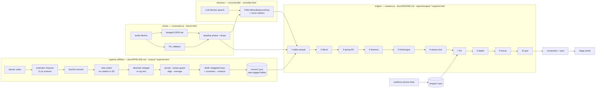

# The whole system on one whiteboard (brief 19.2 Task 1)

The teaching view — what you'd draw to walk a friend from "video of a
dancer" to "creature dancing on stage." The README's Architecture
diagram stays the canonical component map; this one trades precision
for the story. Every box names its doc page and its instrument.

Where each judgment lives:
- capture fidelity → the clip's explorer (overlays 1–8, heatmap) and
  `table-vs-raw.mjs` (R1 — distill ≤ 0.012 everywhere, floor =
  rep-to-rep variation).
- engine fidelity → the engine explorer ladder (`engine-fidelity`
  verify row): spring 0.355 (R2, the named next rung), everything
  else < 0.03.
- the look (R4) → render-mode strip, goo+bones on stage (`m`/`o`).
- the rules of the house → CLAUDE.md (explain-it gate: nothing enters
  the party set without the owner's own paragraph in
  `docs/explained/`).

What breaks where, one line each: wrong landmarks → stage 0–1 picture;
lag → stage 2 (capture) or spring (engine 3); fake depth → view
select / twist; erased posture → rest reference (capture 4) — or the
old measured-rest/midpoint-knee bugs; straight knees → engine
convention remap + lock; weak amplitude → distill budget or octave
guard; feet wrong → contacts + lock yield; welds/flash → goo
union-by-max.
